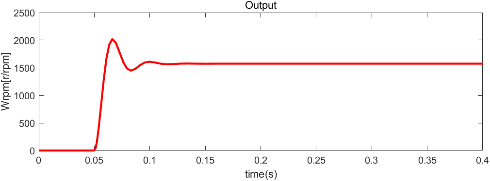

# 전기기기 프로젝트

학번 : 2019440102  
이름 : 이진우

제출일 : 4월 19일 수업시간 전까지  
제출방법 : zmalqpwd1@uos.ac.kr로 Matlab 파일 및 보고서 제출  
총 : 100점
(그림 2.59: B=0.1)  
## 1.
직류전동기를 Simulink로 구현하고 그림 2.61과 같이 전기자 전압을 인가한 경우 속도 특성을 보여라. (10점)

### 직류 전동기 모델

### $V_a = 70\cdot u(t)$

### $V_a = 140 \cdot u(t)$

## 2.
직류전동기에 전류 제어기를 추가하고 그림 2.63과 같은 전류 제어 성능을 보여라. (10점)

### 전류 제어기

### 그림 (a)와 비슷하게
$\omega_{cc} = 2500$ Hz로 맞춰 성능을 비슷하게 만들었다.

### 그림 (b)와 비슷하게
$\omega_{cc} = 5000$ Hz로 맞춰 성능을 비슷하게 만들었다.

## 3. 
직류전동기에 속도 제어기를 추가하고 그림 2.65과 같은 속도 제어 특성을 보여라. (10점)

### 속도 제어기

이 문제를 풀때는 대수루프 관련 오류때문에 모델 하나에 모든 시스템을 넣어 새로 만들었습니다. 또한, 모터의 마찰계수가 0.1일 때 레퍼런스 속도를 따라가지 못하여 원래 교안대로 마찰계수를 0으로 설정하여 실험하였습니다.

### 그림 (a)와 비슷하게
$\omega_{cs} = 250$ Hz로 맞춰 성능을 비슷하게 만들었다.

### 그림 (b)와 비슷하게
$\omega_{cs} = 500$ Hz로 맞춰 성능을 비슷하게 만들었다.

## 4. 
직류전동기에 초퍼 구동 시스템을 추가하고 그림 2.68과 같은 속도, 토크, 전류 특성을 보여라. (10점)

### Chopper

### 속도, 토크, 전류 특성

## 5.
0.05초에 전동기의 속도지령을 1000 RPM으로 주고 0.5초에 전동기에 부하토크가 -10만큼 step으로 걸리게 되었을 때, 속도, 토크, 전류의 그래프를 보이고, 각 구간별로 4상한 운전모드 중 어떤 운전모드인지 설명하여라. (20점)

## 6.
시뮬레이션의 sampling time이 1e-5s (고정 스텝)일 때, 전류 제어기의 대역폭을 각각 100 Hz, 1 kHz, 10 kHz로 설계하고 5번 문제와 같은 지령, 부하 조건에서 전류의 과도응답 특성을 비교하여라. (20점)

## 7.
시뮬레이션의 sampling time이 1e-5s (고정 스텝)이고, 전류 제어기의 대역폭이 1 kHz 일 때, 속도 제어기의 대역폭을 각각 10 Hz, 100 Hz, 1 kHz로 설계하고 5번 문제와 같은 지령, 부하 조건에서 속도의 과도응답 특성을 비교하여라. (20점)

