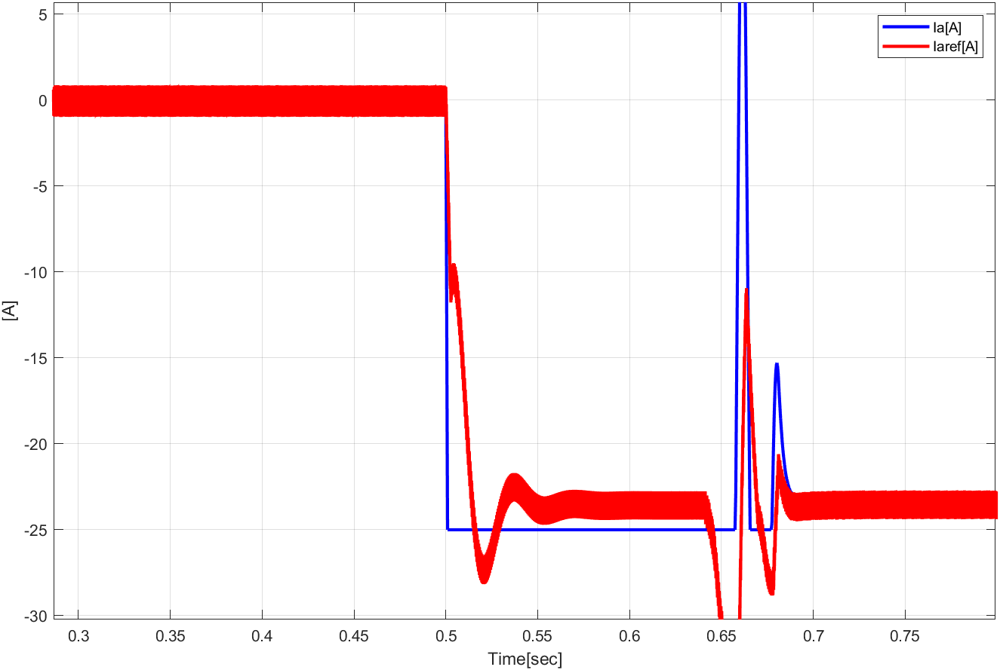
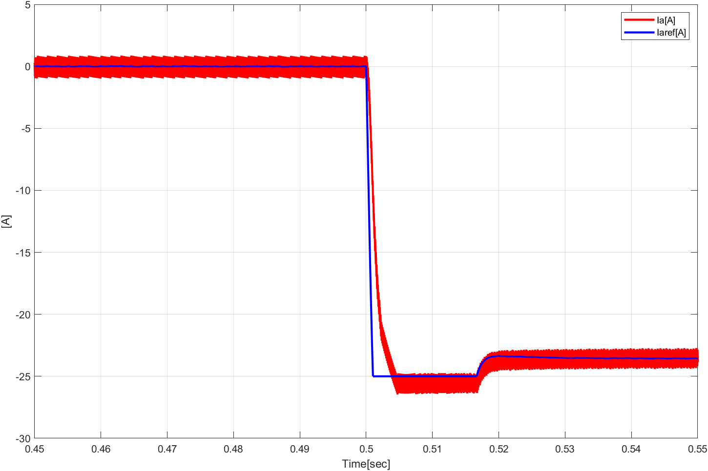

# 전기기기 프로젝트

학번 : 2019440102  
이름 : 이진우

제출일 : 4월 19일 수업시간 전까지  
제출방법 : zmalqpwd1@uos.ac.kr로 Matlab 파일 및 보고서 제출  
총 : 100점  
(그림 2.59: B=0.1)  
## 1.
직류전동기를 Simulink로 구현하고 그림 2.61과 같이 전기자 전압을 인가한 경우 속도 특성을 보여라. (10점)

### 직류 전동기 모델

### $V_a = 70\cdot u(t)$

### $V_a = 140 \cdot u(t)$

## 2.
직류전동기에 전류 제어기를 추가하고 그림 2.63과 같은 전류 제어 성능을 보여라. (10점)

### 전류 제어기

### 그림 (a)와 비슷하게
$\omega_{cc} = 2500$ Hz로 맞춰 성능을 비슷하게 만들었다.  

### 그림 (b)와 비슷하게
$\omega_{cc} = 5000$ Hz로 맞춰 성능을 비슷하게 만들었다.  

## 3. 
직류전동기에 속도 제어기를 추가하고 그림 2.65과 같은 속도 제어 특성을 보여라. (10점)

### 속도 제어기

이 문제를 풀때는 대수루프 관련 오류때문에 모델 하나에 모든 시스템을 넣어 새로 만들었습니다. 또한, 모터의 마찰계수가 0.1일 때 레퍼런스 속도를 따라가지 못하여 원래 교안대로 마찰계수를 0으로 설정하여 실험하였습니다. 또한, 속도가 일정할 때 토크가 0으로 간다는 것은 마찰력이 0이여야만 가능하기도 합니다.

### 그림 (a)와 비슷하게
$\omega_{cs} = 250$ Hz로 맞춰 성능을 비슷하게 만들었다.  

### 그림 (b)와 비슷하게
$\omega_{cs} = 500$ Hz로 맞춰 성능을 비슷하게 만들었다.  

## 4. 
직류전동기에 초퍼 구동 시스템을 추가하고 그림 2.68과 같은 속도, 토크, 전류 특성을 보여라. (10점)

### Chopper

### 속도, 토크, 전류 특성

## 5.
0.05초에 전동기의 속도지령을 1000 RPM으로 주고 0.5초에 전동기에 부하토크가 -10만큼 step으로 걸리게 되었을 때, 속도, 토크, 전류의 그래프를 보이고, 각 구간별로 4상한 운전모드 중 어떤 운전모드인지 설명하여라. (20점)

### 4상한 운전모드
4상한 운전모드는 모터의 회전 방향과 토크의 방향으로 정의되는 모드입니다. 그 구분은 다음 표와 같습니다.

| 종류 |회전 방향|토크 방향|
|:---:|:---:|:---:|
|Forward Motoring|+|+|
|Forward Braking|+|-|
|Reverse Motoring|-|-|
|Reverse Breaking|-|+|

### 구분하기

위 사진을 보면 목표 속도가 정해진 이후 속도는 항상 방향이 같습니다. 따라서 토크의 부호만 고려해, 다음과 같이 4가지 구간으로 나누어 생각할 수 있습니다.

|구간 번호|시간|토크 부호|
|:---:|:---:|:---:|
|1|0.05초 ~ 0.075초 | + |
|2|0.075초 ~ 0.1초 |-|
|3|0.1초 ~ 0.5초 | 0|
|4|0.5초 ~ 1초 | -|

1. 구간 1은 회전 방향도 + 이며, 토크도 가속을 위해 같은 방향으로 작용하므로 Forward Motoring mode입니다.
2. 구간 2는 회전 방향은 + 이지만 목표속도보다 현재 속도가 빨라 감속을 해야하는 상황입니다. 따라서 토크는 반대방향으로 작용하는 것을 표에서 볼 수 있습니다. 그러므로, Forward Breaking mode입니다.
3. 구간 3은 회전 방향은 +, 토크는 평균적으로 0이므로 어느 mode도 아닙니다.
4. 구간 4는 회전 방향은 +, 토크의 방향은 - 이므로 Forward Breaking mode 입니다.

## 6.
시뮬레이션의 sampling time이 1e-5s (고정 스텝)일 때, 전류 제어기의 대역폭을 각각 100 Hz, 1 kHz, 10 kHz로 설계하고 5번 문제와 같은 지령, 부하 조건에서 전류의 과도응답 특성을 비교하여라. (20점)

### 과도응답 특성
1. 오버슈트(Overshoot) 
$$\text{overshoot}(\%) = {\text{maximum value - final value}\over{\text{final value}}}\times 100$$
2. 지연시간($T_d$) : 정상값의 50%에 도달하는데 걸리는 시간
3. 상승시간($T_r$) : 정상값의 0% 에서 100%에 도달하는 시간 (underdamped system)
4. 정착시간($T_s$) : 허용 오차 범위 안에 들어오는 시간 (±2%)

### 비교
특성을 보기 위해 확대한 사진들을 모았습니다.
- $\omega_{cc} = 100$ Hz  

- $\omega_{cc} = 1$ kHz  

- $\omega_{cc} = 10$ kHz  

|$\omega_{cc}$|Overshoot|지연시간|상승시간|정착시간|
|:---:|:---:|:---:|:---:|:---:|
|100Hz|8%|7ms|15ms|52ms|
|1kHz|2.8%|1.2ms|5ms|5ms|
|10kHz|1.2%|0.1ms|0.9ms|1ms|

측정 전류의 값이 chopper에 의해 많이 튀어 정확한 값의 측정이 불가능했습니다. 따라서 평균 전류를 추정하여 위와 같이 정리하였습니다. 기본적으로 $\omega_{cc}$값이 크면 클수록 모든 과도응답 특성들이 좋은 것을 관측할 수 있었습니다.

## 7.
시뮬레이션의 sampling time이 1e-5s (고정 스텝)이고, 전류 제어기의 대역폭이 1 kHz 일 때, 속도 제어기의 대역폭을 각각 10 Hz, 100 Hz, 1 kHz로 설계하고 5번 문제와 같은 지령, 부하 조건에서 속도의 과도응답 특성을 비교하여라. (20점)

### 비교
- $\omega_{cs} = 10$ Hz  

- $\omega_{cs} = 100$ Hz  

- $\omega_{cs} = 1$ kHz  

|$\omega_{cs}$|Overshoot|지연시간|상승시간|정착시간|
|:---:|:---:|:---:|:---:|:---:|
|10Hz|6.1%|28.5ms|117.4ms|2s|
|100Hz|5.5%|12.9ms|28ms|80ms|
|1kHz|1.5%|12.9ms|26.3ms|25.7ms|

$\omega_{cs}$가 증가하면 증가할수록 과도응답 특성들의 크기는 작아집니다.

특히나, 100Hz -> 1kHz로 커졌을 때 약간의 이변이 있습니다. 상승시간의 차이는 거의 없었지만, overshoot이 2% 미만으로 생겨 정착시간이 상승시간보다 짧은 것을 알 수 있습니다.
