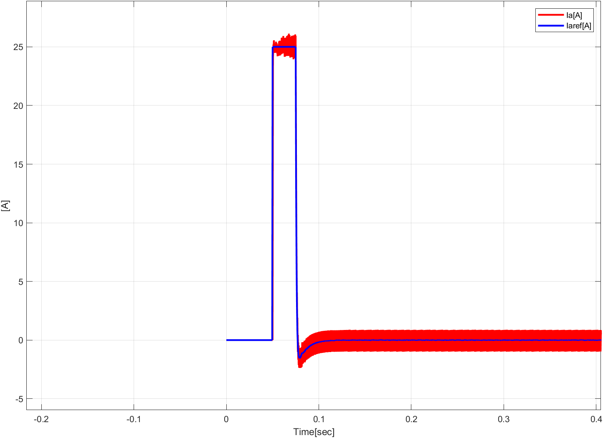

# 전기기기 프로젝트

학번 : 2019440102  
이름 : 이진우

제출일 : 4월 19일 수업시간 전까지  
제출방법 : zmalqpwd1@uos.ac.kr로 Matlab 파일 및 보고서 제출  
총 : 100점
(그림 2.59: B=0.1)  
## 1.
직류전동기를 Simulink로 구현하고 그림 2.61과 같이 전기자 전압을 인가한 경우 속도 특성을 보여라. (10점)

### 직류 전동기 모델

### $V_a = 70\cdot u(t)$

### $V_a = 140 \cdot u(t)$

## 2.
직류전동기에 전류 제어기를 추가하고 그림 2.63과 같은 전류 제어 성능을 보여라. (10점)

### 전류 제어기

### 그림 (a)와 비슷하게
$\omega_{cc} = 2500$ Hz로 맞춰 성능을 비슷하게 만들었다.

### 그림 (b)와 비슷하게
$\omega_{cc} = 5000$ Hz로 맞춰 성능을 비슷하게 만들었다.

## 3. 
직류전동기에 속도 제어기를 추가하고 그림 2.65과 같은 속도 제어 특성을 보여라. (10점)

### 속도 제어기

이 문제를 풀때는 대수루프 관련 오류때문에 모델 하나에 모든 시스템을 넣어 새로 만들었습니다. 또한, 모터의 마찰계수가 0.1일 때 레퍼런스 속도를 따라가지 못하여 원래 교안대로 마찰계수를 0으로 설정하여 실험하였습니다.

### 그림 (a)와 비슷하게
$\omega_{cs} = 250$ Hz로 맞춰 성능을 비슷하게 만들었다.

### 그림 (b)와 비슷하게
$\omega_{cs} = 500$ Hz로 맞춰 성능을 비슷하게 만들었다.

## 4. 
직류전동기에 초퍼 구동 시스템을 추가하고 그림 2.68과 같은 속도, 토크, 전류 특성을 보여라. (10점)

### Chopper

### 속도, 토크, 전류 특성

## 5.
0.05초에 전동기의 속도지령을 1000 RPM으로 주고 0.5초에 전동기에 부하토크가 -10만큼 step으로 걸리게 되었을 때, 속도, 토크, 전류의 그래프를 보이고, 각 구간별로 4상한 운전모드 중 어떤 운전모드인지 설명하여라. (20점)

### 4상한 운전모드
4상한 운전모드는 모터의 회전 방향과 토크의 방향으로 정의되는 모드입니다. 그 구분은 다음 표와 같습니다.

| 종류 |회전 방향|토크 방향|
|:---:|:---:|:---:|
|Forward Motoring|+|+|
|Forward Braking|+|-|
|Reverse Motoring|-|-|
|Reverse Breaking|-|+|

### 구분하기

위 사진을 보면 목표 속도가 정해진 이후 속도는 항상 방향이 같습니다. 따라서 토크의 부호만 고려해, 다음과 같이 4가지 구간으로 나누어 생각할 수 있습니다.

|구간 번호|시간|토크 부호|
|:---:|:---:|:---:|
|1|0.05초 ~ 0.075초 | + |
|2|0.075초 ~ 0.1초 |-|
|3|0.1초 ~ 0.5초 | 0|
|4|0.5초 ~ 1초 | -|

1. 구간 1은 회전 방향도 + 이며, 토크도 가속을 위해 같은 방향으로 작용하므로 Forward Motoring mode입니다.
2. 구간 2는 회전 방향은 + 이지만 목표속도보다 현재 속도가 빨라 감속을 해야하는 상황입니다. 따라서 토크는 반대방향으로 작용하는 것을 표에서 볼 수 있습니다. 그러므로, Forward Breaking mode입니다.
3. 구간 3은 회전 방향은 +, 토크는 평균적으로 0이므로 어느 mode도 아닙니다.
4. 구간 4는 회전 방향은 +, 토크의 방향은 - 이므로 Forward Breaking mode 입니다.

## 6.
시뮬레이션의 sampling time이 1e-5s (고정 스텝)일 때, 전류 제어기의 대역폭을 각각 100 Hz, 1 kHz, 10 kHz로 설계하고 5번 문제와 같은 지령, 부하 조건에서 전류의 과도응답 특성을 비교하여라. (20점)

### 비교
#### $\omega_{cc} = 100$ Hz

#### $\omega_{cc} = 1$ kHz

#### $\omega_{cc} = 10$ kHz

1. **시간 상수 (Time Constant)**: 시간 상수는 시스템이 안정된 상태에 도달하는 데 걸리는 시간을 나타냅니다. 목표 속도에 도달하는데 걸리는 시간과 실제 속도에 도달하는데 걸리는 시간을 비교하여 각각의 시간 상수를 계산할 수 있습니다.

2. **초과 및 부족 (Overshoot and Undershoot)**: 초과 및 부족은 목표 값에 도달한 후에 실제 값이 얼마나 더 높거나 낮은지를 나타냅니다. 목표 속도에 도달한 후의 최대 초과 및 부족을 비교하여 응답의 과도성을 평가할 수 있습니다.

3. **안정성 (Stability)**: 안정성은 시스템이 목표 값 주변에서 얼마나 안정적으로 유지되는지를 나타냅니다. 목표 속도와 실제 속도 사이의 오차를 평가하여 안정성을 비교할 수 있습니다.

4. **오차 (Error)**: 목표 속도에 도달하기 위한 시스템의 오차를 분석하여 각 시뮬레이션 결과 간의 오차를 비교할 수 있습니다.

5. **응답 시간 (Rise Time)**: 응답 시간은 시스템이 목표 값에 도달하는 데 걸리는 시간을 나타냅니다. 목표 속도에 도달하는데 걸리는 시간을 비교하여 각각의 응답 시간을 분석할 수 있습니다.

## 7.
시뮬레이션의 sampling time이 1e-5s (고정 스텝)이고, 전류 제어기의 대역폭이 1 kHz 일 때, 속도 제어기의 대역폭을 각각 10 Hz, 100 Hz, 1 kHz로 설계하고 5번 문제와 같은 지령, 부하 조건에서 속도의 과도응답 특성을 비교하여라. (20점)

